<!--
  Profile README for github.com/Simon-Njoroge
  The animated cards live in ./assets/ (pure SVG + CSS/SMIL — no JavaScript, so GitHub renders them).
  Keep the repo name equal to the username (Simon-Njoroge/Simon-Njoroge) for this file to show on the profile.
-->

  

I build machine learning systems that ship: retrieval-augmented LLM pipelines, model fine-tuning and evaluation, and the FastAPI + React products that put them in front of users. Based in Nairobi, working on AI for African markets.

**Now**: Lead Systems Engineer at Nyakezi Global, building an AI-assisted legal platform for Kenya: document intelligence over case law, structured drafting, and evaluation harnesses so the models stay honest.

**Before**: BSc Computer Science (Kirinyaga University); mobile and web engineering at eMobilis and Teach2Give; Microsoft AI Fundamentals certified.

  

### What I work with

| Area | Tools |
|---|---|
| Modelling | PyTorch · scikit-learn · Hugging Face Transformers · PEFT / LoRA |
| LLM systems | LangChain · vector search (pgvector, FAISS) · prompt & eval pipelines · OpenAI / Anthropic APIs |
| Data | Python · pandas · NumPy · PostgreSQL · MySQL |
| Serving | FastAPI · Docker · Node.js · GitHub Actions |
| Product | React · TypeScript · React Native · Tailwind |

### Currently learning

- Reinforcement learning from feedback for domain-specific assistants
- Efficient inference: quantisation and serving small models on modest hardware
- Kiswahili and Sheng NLP: low-resource language data and evaluation

### Let's talk

- Email: [mukirisimon22@gmail.com](mailto:mukirisimon22@gmail.com)
- LinkedIn: [linkedin.com/in/youngdeveloper](https://www.linkedin.com/in/youngdeveloper)
- Writing: [dev.to/dev_simon](https://dev.to/dev_simon)

  
  

  

